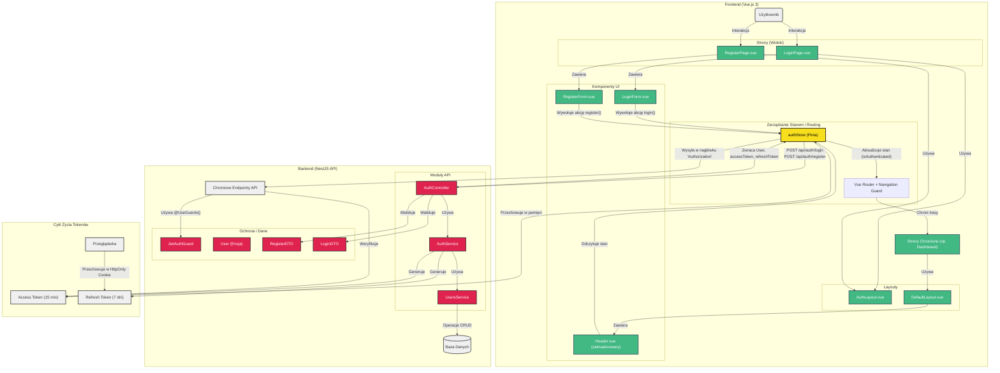

<architecture_analysis>
1.  **Komponenty:**
    *   **Frontend (Vue.js 3):**
        *   Layouty: `AuthLayout.vue`, `DefaultLayout.vue`
        *   Strony (Widoki): `RegisterPage.vue`, `LoginPage.vue`, `ForgotPasswordPage.vue`, `ResetPasswordPage.vue`
        *   Komponenty formularzy: `RegisterForm.vue`, `LoginForm.vue`
        *   Komponenty UI: `Header.vue`
        *   Zarządzanie stanem (Pinia): `authStore`
        *   Routing: `Vue Router` z `Navigation Guard`
        *   Walidacja: `VeeValidate` + `zod`/`yup`
    *   **Backend (NestJS):**
        *   Moduły: `AuthModule`, `UsersModule`
        *   Kontroler: `AuthController`
        *   Serwisy: `AuthService`, `UsersService`
        *   DTOs: `RegisterDto`, `LoginDto`
        *   Encja: `User.entity.ts`
        *   Strategia: `Passport.js` + `JWT`
        *   Guards: `JwtAuthGuard`

2.  **Główne strony i komponenty:**
    *   Strony publiczne (`/login`, `/register`) używają `AuthLayout.vue`.
    *   `RegisterPage.vue` zawiera `RegisterForm.vue`.
    *   `LoginPage.vue` zawiera `LoginForm.vue`.
    *   Strony chronione (`/dashboard`) używają `DefaultLayout.vue`.
    *   `DefaultLayout.vue` zawiera `Header.vue` z logiką warunkową.

3.  **Przepływ danych:**
    *   Użytkownik wypełnia formularz (`RegisterForm`/`LoginForm`).
    *   Komponent formularza wywołuje akcję w `authStore` (`register`/`login`).
    *   `authStore` wysyła żądanie do API (`/api/auth/register` lub `/api/auth/login`).
    *   `AuthController` obsługuje żądanie, waliduje DTO i wywołuje `AuthService`.
    *   `AuthService` realizuje logikę biznesową (weryfikacja, tworzenie użytkownika, generowanie tokenów).
    *   API zwraca `accessToken`, `refreshToken` i dane użytkownika.
    *   `authStore` zapisuje tokeny i dane, aktualizując stan `isAuthenticated`.
    *   `Navigation Guard` w Vue Router reaguje na zmianę stanu, zezwalając lub blokując dostęp do tras.
    *   Komponenty (np. `Header.vue`) subskrybują zmiany w `authStore` i aktualizują swój widok.

4.  **Opis funkcjonalności komponentów:**
    *   **`AuthLayout.vue`**: Minimalistyczny layout dla widoków autentykacji.
    *   **`DefaultLayout.vue`**: Główny layout aplikacji z nawigacją dla zalogowanych użytkowników.
    *   **`RegisterForm.vue` / `LoginForm.vue`**: Zarządzają stanem formularza, walidacją i interakcją z `authStore`.
    *   **`authStore` (Pinia)**: Centralne miejsce zarządzania stanem autentykacji (użytkownik, tokeny, status zalogowania).
    *   **`Navigation Guard` (Vue Router)**: Chroni trasy wymagające zalogowania.
    *   **`AuthController`**: Odbiera żądania HTTP i deleguje je do serwisu.
    *   **`AuthService`**: Implementuje logikę uwierzytelniania, haszowanie haseł i generowanie tokenów JWT.
    *   **`JwtAuthGuard`**: Zabezpiecza endpointy API, weryfikując `accessToken`.
</architecture_analysis>
<mermaid_diagram>

</mermaid_diagram>
